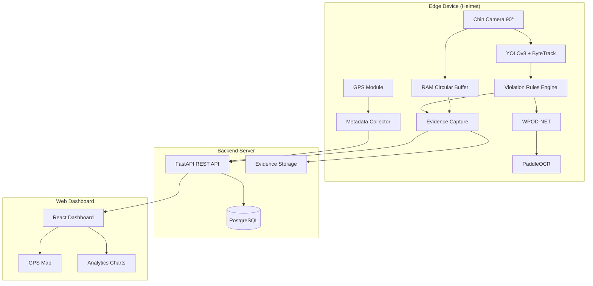
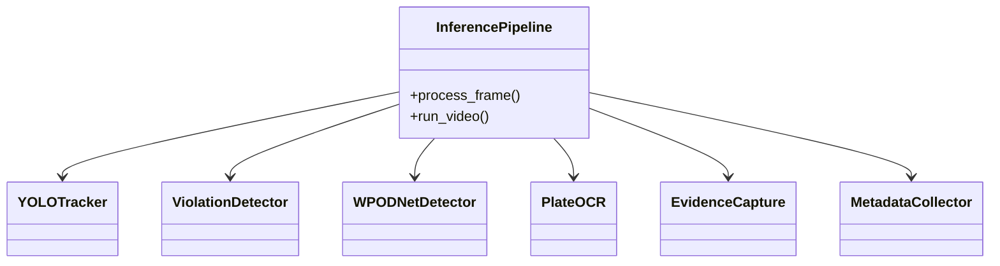
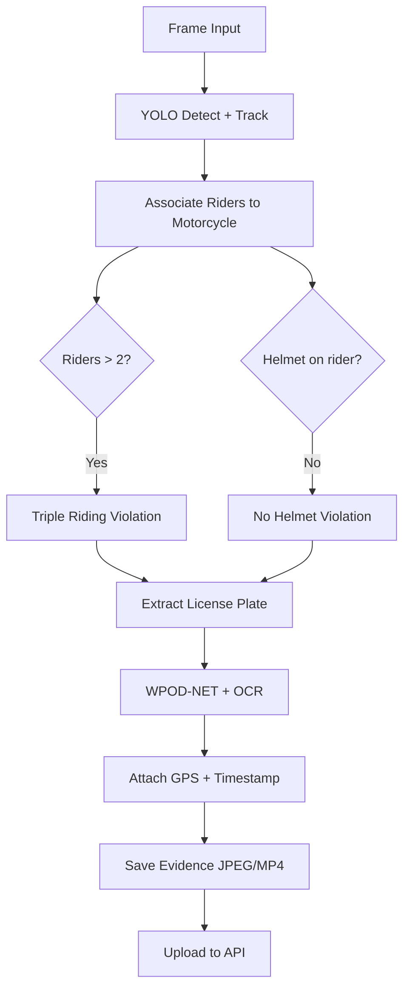
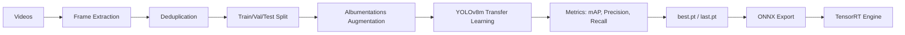
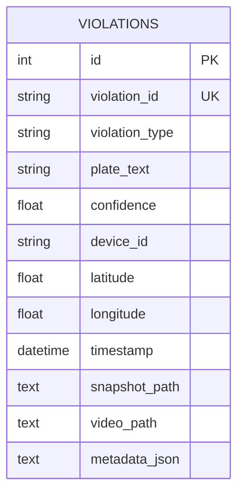

# Architecture

## System Overview

```mermaid
flowchart TB
    subgraph Edge["Edge Device (Helmet)"]
        CAM[Chin Camera 90°]
        BUF[RAM Circular Buffer]
        YOLO[YOLOv8 + ByteTrack]
        RULES[Violation Rules Engine]
        WPOD[WPOD-NET]
        OCR[PaddleOCR]
        EVD[Evidence Capture]
        GPS[GPS Module]
        META[Metadata Collector]
    end

    subgraph Server["Backend Server"]
        API[FastAPI REST API]
        DB[(PostgreSQL)]
        STORE[Evidence Storage]
    end

    subgraph Client["Web Dashboard"]
        UI[React Dashboard]
        MAP[GPS Map]
        CHARTS[Analytics Charts]
    end

    CAM --> BUF
    CAM --> YOLO
    YOLO --> RULES
    RULES --> WPOD
    WPOD --> OCR
    RULES --> EVD
    BUF --> EVD
    GPS --> META
    META --> API
    EVD --> API
    API --> DB
    EVD --> STORE
    API --> UI
    UI --> MAP
    UI --> CHARTS
```

## Module Interaction (UML Component)

```mermaid
classDiagram
    class InferencePipeline {
        +process_frame()
        +run_video()
    }
    class YOLOTracker
    class ViolationDetector
    class WPODNetDetector
    class PlateOCR
    class EvidenceCapture
    class MetadataCollector

    InferencePipeline --> YOLOTracker
    InferencePipeline --> ViolationDetector
    InferencePipeline --> WPODNetDetector
    InferencePipeline --> PlateOCR
    InferencePipeline --> EvidenceCapture
    InferencePipeline --> MetadataCollector
```

## Violation Detection Flow

```mermaid
flowchart TD
    A[Frame Input] --> B[YOLO Detect + Track]
    B --> C[Associate Riders to Motorcycle]
    C --> D{Riders > 2?}
    D -->|Yes| E[Triple Riding Violation]
    C --> F{Helmet on rider?}
    F -->|No| G[No Helmet Violation]
    E --> H[Extract License Plate]
    G --> H
    H --> I[WPOD-NET + OCR]
    I --> J[Attach GPS + Timestamp]
    J --> K[Save Evidence JPEG/MP4]
    K --> L[Upload to API]
```

## Training Pipeline

```mermaid
flowchart LR
    V[Videos] --> F[Frame Extraction]
    F --> D[Deduplication]
    D --> S[Train/Val/Test Split]
    S --> A[Albumentations Augmentation]
    A --> T[YOLOv8m Transfer Learning]
    T --> M[Metrics: mAP, Precision, Recall]
    M --> W[best.pt / last.pt]
    W --> O[ONNX Export]
    O --> R[TensorRT Engine]
```

## Data Model

```mermaid
erDiagram
    VIOLATIONS {
        int id PK
        string violation_id UK
        string violation_type
        string plate_text
        float confidence
        string device_id
        float latitude
        float longitude
        datetime timestamp
        text snapshot_path
        text video_path
        text metadata_json
    }
```
